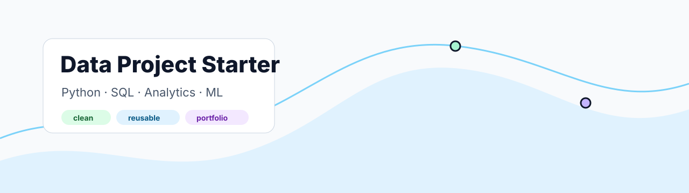

# Data Project Starter

<p align="center">
  
</p>

A clean starter template for future data, analytics, and machine learning portfolio projects.

## Use this template

Create a new repository from this template when you want a project to start organized from day one.

Good first signals for the new repo:

- A clear English name, for example `financial-risk-dashboard`.
- A short description focused on the data problem.
- Topics such as `python`, `sql`, `analytics`, `data-engineering`, or `machine-learning`.

## Project Structure

```text
.
├── data/
│   ├── raw/
│   └── processed/
├── notebooks/
├── reports/
├── src/
├── tests/
├── requirements.txt
└── pyproject.toml
```

## Run Locally

```bash
python -m venv .venv
source .venv/bin/activate
pip install -r requirements.txt
```

## Quality

This template includes a GitHub Actions workflow for:

- Python setup
- dependency installation
- Ruff linting
- pytest checks

Keep CI light at the beginning. Add stricter tests when the project logic becomes reusable.

## Profile Automation

When a public repository created from this template has data-oriented topics or description, the profile workflow in `guivital1/guivital1` can detect it and refresh the portfolio radar.
